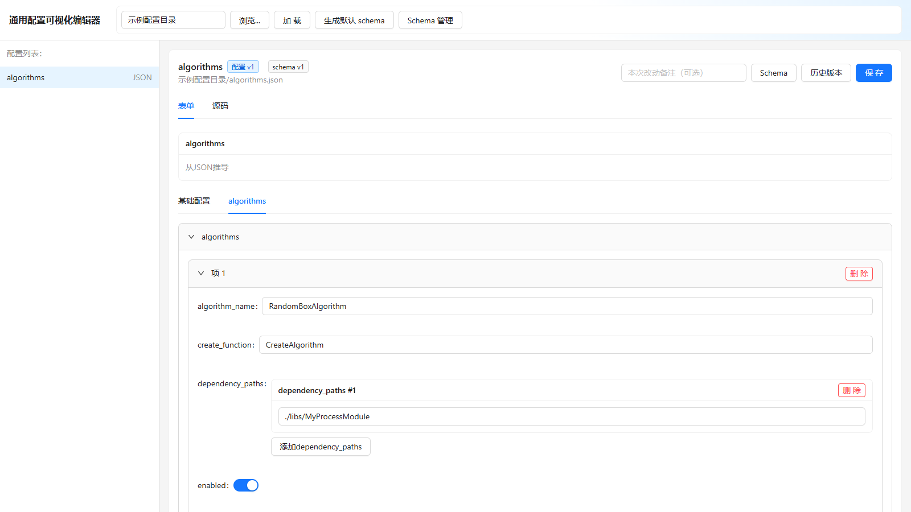
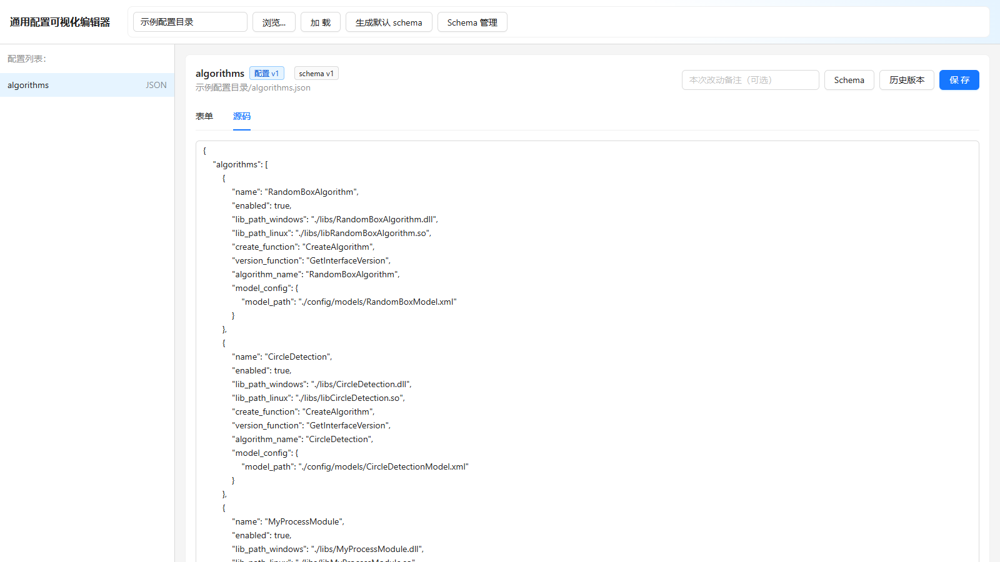
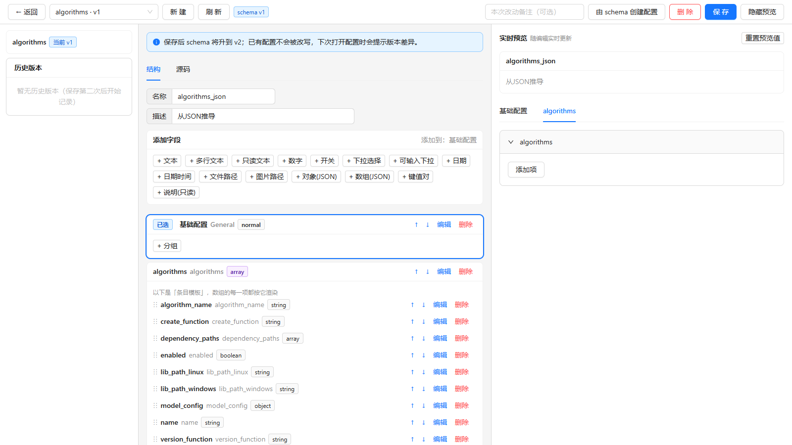

# ConfigManager

 

**让项目里的配置文件更容易找到、看懂和维护。** ConfigManager 是一款开箱即用的桌面编辑器：选中配置目录后，就能集中浏览 JSON、XML 文件，通过表单或源码修改内容，并在保存前留下备份。项目里配置文件越来越多、手改容易出错时，它可以把常见编辑工作收拢到一个界面。

目前支持 **JSON 和 XML**；**YAML 仍在计划中，当前版本不能编辑 YAML**。

[下载最新测试构建](https://github.com/tlx2024/CongfigManager/actions/workflows/ci.yml) · [正式版本](https://github.com/tlx2024/CongfigManager/releases) · [反馈问题](https://github.com/tlx2024/CongfigManager/issues)

## 界面预览

以下画面使用仓库自带的示例 JSON 和 Schema，展示当前版本的真实前端界面。

查看源码编辑和 Schema 管理界面

## 三步开始

1. 目前还没有正式 Release，可先从成功的 [Actions 构建记录](https://github.com/tlx2024/CongfigManager/actions/workflows/ci.yml)下载与你的系统匹配的测试安装包；后续正式版将放在 [Releases](https://github.com/tlx2024/CongfigManager/releases)。
2. 首次打开可直接使用应用准备的示例配置；要编辑自己的文件，点击「浏览…」选择配置目录，再点击「加载」。配置文件可放在该目录下，或放在它的 `config/` 子目录下。
3. 在左侧选中配置，使用「表单」或「源码」修改，确认后点击「保存」。应用会先备份原文件，历史版本可加载回编辑区查看或恢复。

| 系统 | 安装包 |
| --- | --- |
| Windows x64 | `.exe` 或 `.msi` |
| macOS Apple Silicon / Intel | 对应架构的 `.dmg` |
| Linux x64 | `.AppImage` 或 `.deb` |

安装好的桌面应用不要求用户另行安装 Node.js 或 Rust。macOS 安装包目前未经过 Apple 公证，首次打开时可能需要在系统「隐私与安全性」中允许。

## 能做什么

- **集中编辑**：扫描目录中的 JSON、XML 配置，按文件名组织条目；不必在大量文件之间反复切换。
- **表单和源码双视图**：日常字段可在表单中修改，需要精确控制文本时可切到源码视图。
- **自动生成可编辑表单**：没有 Schema 时，应用会根据现有配置推导表单；JSON 配置还可生成默认 Schema。已有手写 Schema 不会被默认生成操作覆盖。
- **自定义 Schema**：在「Schema 管理」中编辑分组、字段、校验规则和数组条目，并预览最终表单。这里使用的是项目自定义的 groups schema，不是标准 JSON Schema。
- **备份与版本**：保存配置前备份旧内容；配置和 Schema 分别记录版本。加载历史只更新编辑区，点击「保存」后才会写回磁盘。

ConfigManager 直接编辑你选择的本地目录。建议先用内置示例熟悉操作，再接入正在使用的项目配置。

## 开发与许可

开发、测试、目录约定和 Schema 格式见 [开发文档](docs/DEVELOPMENT.md)；版本发布步骤见 [发布文档](docs/RELEASING.md)。

Copyright (C) 2026 **tlx2024**。本项目按 [AGPL-3.0-or-later](LICENSE) 许可发布，原作者信息见 [COPYRIGHT.md](COPYRIGHT.md)。再分发时应保留原有版权和许可声明；分发修改版时应按协议提供对应源码。网络提供修改版服务时也适用 AGPL 的源码提供要求。

欢迎通过 [Issues](https://github.com/tlx2024/CongfigManager/issues) 反馈问题，或阅读 [贡献说明](CONTRIBUTING.md) 后提交修改。
